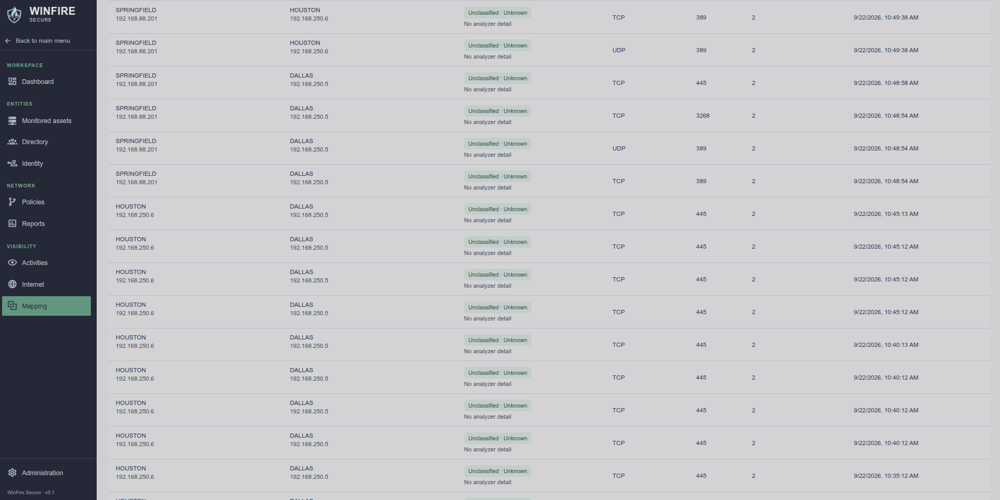
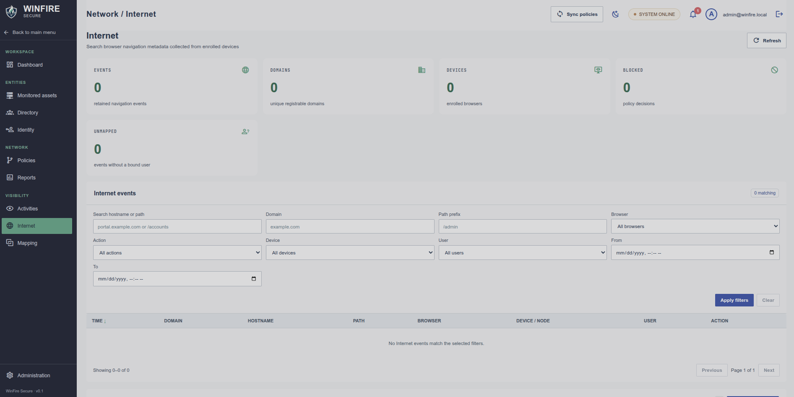
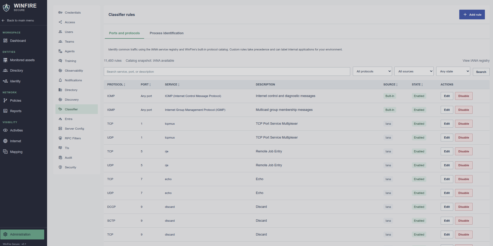
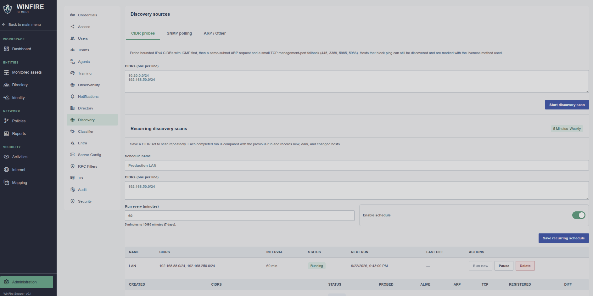
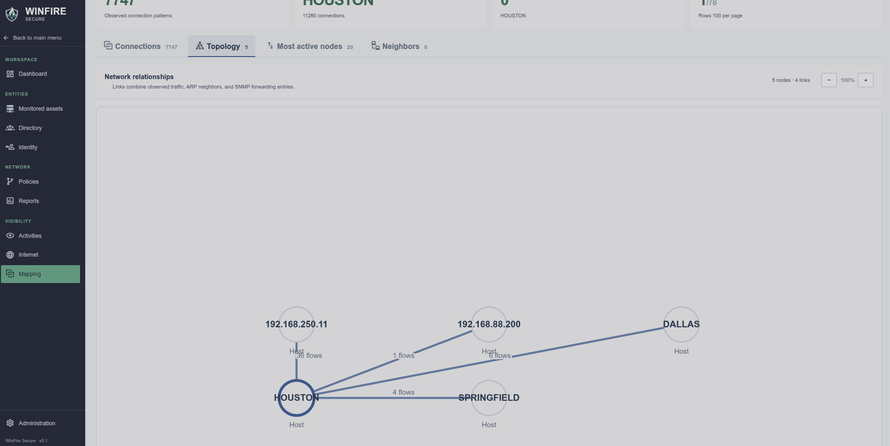

# WinFire Secure

WinFire Secure is an API-first control plane for host inventory, firewall visibility and policy, network mapping, and identity-based access. The Vue operator interface and Express API can be served from one origin. The current persistent store is SQLite.

## Documentation

| Guide | Contents |
|---|---|
| [Installation and configuration](docs/INSTALLATION.md) | Native/systemd, Docker, Dokploy, environment settings, TLS/mTLS, bootstrap accounts, backups, upgrades and troubleshooting. |
| [Operator guide](docs/USAGE.md) | Discovery, inventory, triage, groups, policy learning, events, mapping, administration and every interface route. |
| [API usage and curl examples](docs/API.md) | Authentication, inventory queries, credentials, discovery, DHCP, groups, events, topology and JIT access. |
| [Complete API route reference](docs/API_ROUTES.md) | Every registered API operation, authentication/permission gates, source handler links and published request schemas. |
| [Internet connections](docs/INTERNET_CONNECTIONS.md) | Outside-LAN firewall observations, dual-stack CIDRs, PTR evidence, lifecycle, API filters and exports. |
| [SNMP MIB library](docs/SNMP_LIBRARY.md) | Built-in coverage, filesystem storage, multipart uploads/downloads, full Cisco and LibreNMS catalog imports, matching, device links, collected facts and curl examples. |
| [DHCP lease import](docs/DHCP_IMPORT.md) | Windows export script, preview/import, MAC/IP correlation, retained evidence, conflict handling and API contract. |
| [JIT MFA: how it works](docs/JIT_MFA.md) | Setup, supported platforms, prompting, identity checks, firewall gates, temporary grants, expiry, fallback and verification. |
| [Enterprise Internet deployment](docs/INTERNET_ENTERPRISE_DEPLOYMENT.md) | Browser extension deployment and URL telemetry/policy. |

Live OpenAPI: **`GET /api/v1/openapi.json`**. Regenerate the route reference with `npm run docs:api`; generation uses a disposable database and does not contact inventory hosts.

## Feature summary

- **Inventory and correlation:** local-CIDR inventory boundary, server-side search/filter/sort/pagination, managed-first ordering, MAC correlation, TTL family hints, authenticated OS/hardware facts, hypervisor identity, ESXi VM inventory/correlation, and retained device-classification evidence. External peers remain in events and mapping.
- **Discovery:** CIDR scans with ICMP/ARP/TCP fallback; recurring scans with new/dark/changed diffs; Windows directory sync; SNMP identity/ARP/routes/TCP/forwarding tables, hardware/interface/LLDP coverage, and an importable MIB library with automatic device matching; Linux SSH defaults; passive ARP candidates; optional Windows DHCP lease import with preview and conflict reports.
- **Management:** Windows agentless transports, Linux SSH facts and supported firewall actions, SNMP visibility, VMware ESXi API inventory, and optional enrolled agents. Unknown/discovery-only assets remain unmanaged until independent management verification succeeds.
- **Triage and groups:** unmanaged/rogue asset queue, bulk credential retry/flag/exclude/restore, static groups and server-evaluated dynamic membership rules.
- **Vault and access:** encrypted write-only credentials, resource grants, credential preflight and rotation-failure notices, owner/admin/editor/auditor permissions, custom roles, teams, invitations, TOTP and audit history.
- **Policies and learning:** visual/classic editors, versions/diffs, conflict checks, assignments, verification, scheduled sync, training proposals, progressive learning and rollback workflows.
- **Events and mapping:** separate Firewall events and Accounts tables, transaction details and quick rule actions, classifier catalog/custom rules, exports/ignores, WEF/agent collection, topology graph, neighbors, top talkers and node/subnet/switch/time filters.
- **Identity and JIT MFA:** TOTP or Entra portal requests, optional source-desktop browser prompts, scoped temporary Windows firewall grants, host-local expiry plus server cleanup, optional account-right baselines and audited fallback behavior.
- **Operations:** administration settings, TLS/agent PKI, branding, notifications, security automation, Internet extension visibility, retention/compaction, reporting and health endpoints.

Capabilities depend on the transport, permissions and remote platform. SNMP tables vary by device/MIB. TTL hints are advisory. SSH source-desktop prompting is implemented, while the current agentless **portal grant target still requires WinRM/WinRMS**. See the supported-path table in the JIT MFA guide.

## Quick start

Use Node.js 24 (matching the Docker image), npm, Python 3/venv and a writable data directory. From a checkout:

```bash
npm ci
npm run setup:winrm
cp .env.example .env
chmod 600 .env
# Edit .env: replace JWT/vault placeholders, choose owner credentials,
# disable the demo admin in production and set your public origin.
npm run build
node --env-file=.env api/src/server.js
```

The application does not automatically load `.env`; the explicit Node option above does. If your service manager already exports the environment, `npm start` builds and starts the app. Default listener: `http://localhost:3000`. Native TLS or a configured HTTPS proxy is required for production browser access; enrolled agents require native mTLS connectivity.

`BOOTSTRAP_EMAIL` / `BOOTSTRAP_PASSWORD` provision an owner on an empty database. **`BOOTSTRAP_ADMIN_*` controls a separate demo account that is reconciled on every restart**, not a one-time owner setup. Set `BOOTSTRAP_ADMIN_ENABLED=false` in production. Read the installation guide before configuring persistent secrets and TLS.

```bash
curl --fail http://localhost:3000/api/v1/health
curl --fail http://localhost:3000/api/v1/openapi.json -o openapi.json
```

For Docker/systemd/Dokploy, full environment reference and backup/recovery procedures, see [Installation](docs/INSTALLATION.md).

## First operator session

1. Sign in with the owner and configure **Server config → Local asset CIDRs** and the public HTTPS URL.
2. Add vault credentials, test a representative Windows/SSH host, and configure the appropriate discovery source.
3. Review local assets and management verification. Use SNMP for supported network-device visibility and API credentials for ESXi inventory.
4. To enrich from DHCP without a scan, export with `scripts/Export-DhcpLeases.ps1`, then use **Discovery → DHCP leases → Preview import → Import eligible leases**.
5. Review unmanaged triage, group membership, training evidence and proposed policy changes before enforcement.
6. Inspect Firewall events, Accounts and Mapping; use the same server-side scopes across tables and topology.
7. Configure Identity segments only after their firewall gates are verified. Test MFA, grant expiry and explicit revocation.

## API quick example

All operator calls use `/api/v1` and a bearer access token. Login returns an access token and rotating refresh token; protect both.

```bash
BASE='https://winfire.example.com/api/v1'
# login.json contains your email/password (and totp when enabled); restrict its permissions.
LOGIN=$(curl --fail-with-body "$BASE/auth/login" \
  -H 'Content-Type: application/json' --data-binary @login.json)
TOKEN=$(printf '%s' "$LOGIN" | jq -er '.accessToken')
curl --fail-with-body --get "$BASE/nodes" -H "Authorization: Bearer $TOKEN" \
  --data-urlencode 'page=1' --data-urlencode 'pageSize=25' \
  --data-urlencode 'filter=managed' --data-urlencode 'sort=priority'
```

See [API examples](docs/API.md) for refresh/logout, mutation payloads, discovery, mapping, DHCP import and MFA calls. Some older routes expose generic OpenAPI schemas; the complete route reference links to their exact handler validation.

## How JIT MFA functions

A segment defines the protected host/group, TCP ports, eligible identities and grant lifetime. The user requests access directly or receives a browser prompt after matching blocked-connection evidence. WinFire verifies TOTP or Entra MFA, validates source/target scope and the enforced policy, then remotely checks that the target's firewall gate is closed and free of conflicting rules.

On success, WinFire installs a temporary allow rule for the actual requesting source IP and selected ports, confirms it, and records the grant and audit evidence. The target schedules local cleanup; the server also sweeps expired grants and supports explicit revocation. The application on the target still performs its normal login. Default prompt failure behavior is closed; an optional constrained fallback is separately configured and audited. Browser launch alone never constitutes MFA approval.

The [JIT MFA guide](docs/JIT_MFA.md) explains prerequisites, Windows target enforcement, Linux/Windows source prompting, TOTP/Entra setup, NAT/proxy implications, LSA baselines, expiry, failure handling and verification.

## Development

```bash
npm run dev:api      # API watcher; export environment first
npm run dev:web      # Vite in a second terminal; /api proxies to port 3000
npm test
npm run build
npm run docs:api
```

The frontend route is `/` for Dashboard, `/inventory` for assets/groups/triage, `/logs` for event/account activity, `/mapping` for topology and connections, `/identity` for access workflows, and `/admin` for configuration. See the [full route map](docs/USAGE.md#interface-route-map).

## Screenshots and visual references

## Simple Dashboard


## Intuitive Administration


## Easily Identify Assets using Active Directory, ICMP, or SNMP Scanning.


## Drag and Drop Policy Editor


## Easily Identify Firewall Events from every node in one place with simple one-click rule creation.


## Enterprise Logon


## Dynamic Rules Engine Auto-Learns from traffic detected at the client firewalls.


## Active Directory Integration for Security and MFA Identity.


## Network Mapping Features to identify who is talking to who as well as top talkers.


## Browser Extension for Enterprise Deployment allows URL monitoring / policy blocking


## Customizable Traffic Classifier


## Robust Network Discovery Options


## Visual Network Topology Mapping

