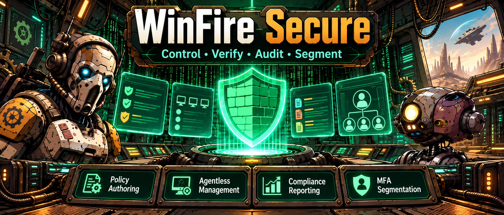
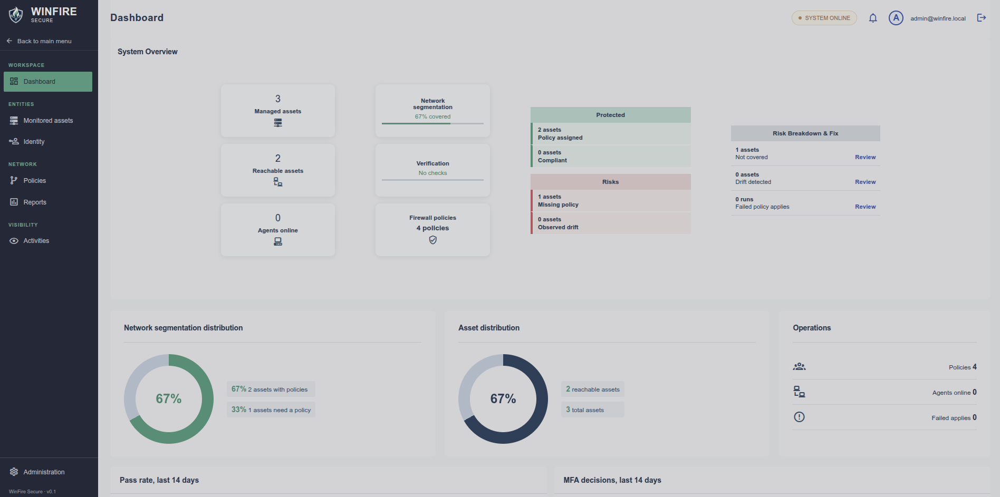
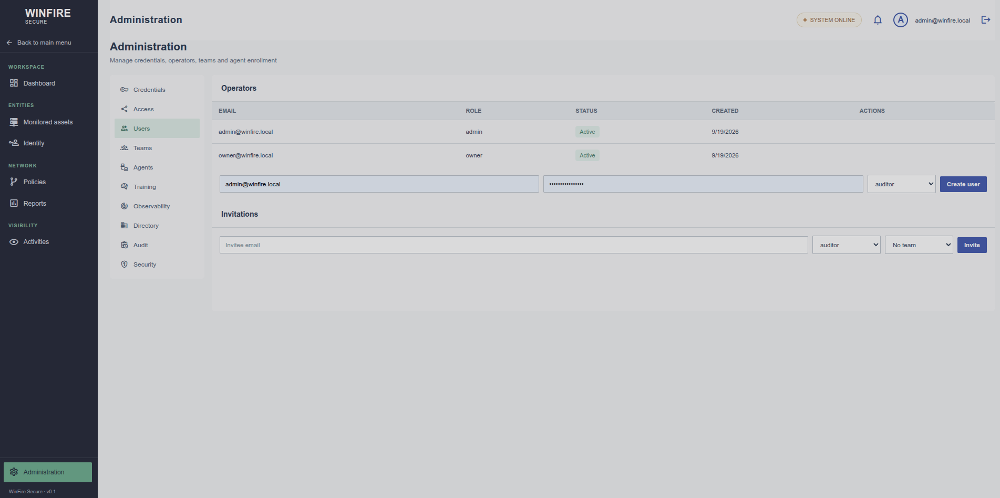
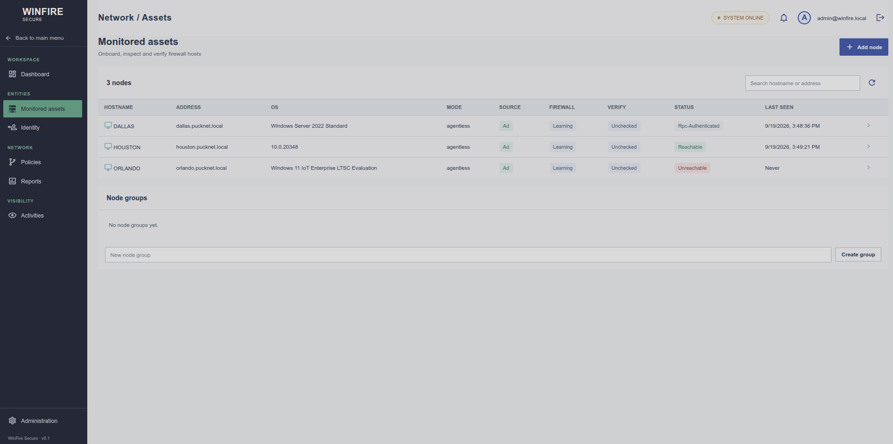
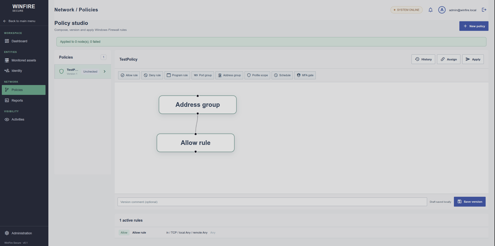
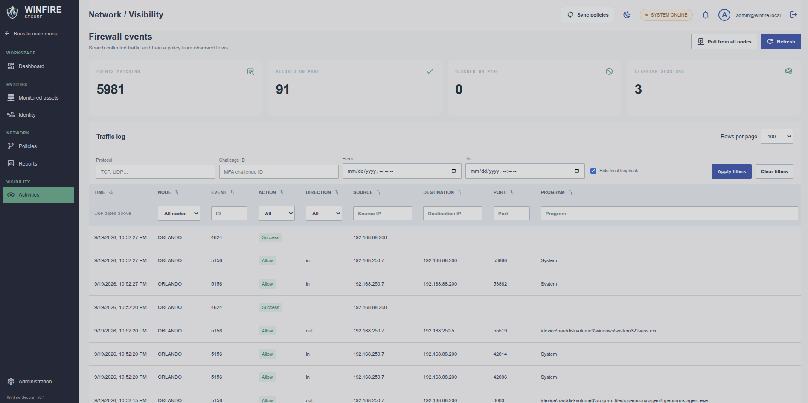
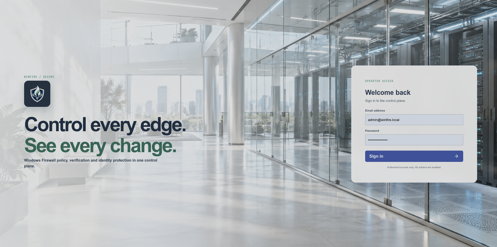
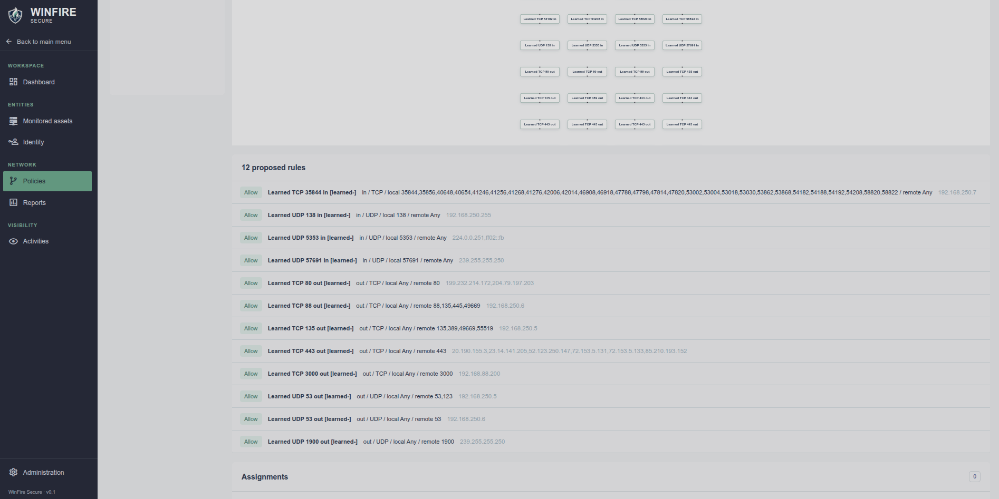
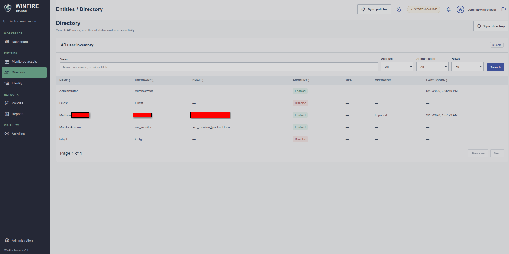

# WinFire Secure

WinFire Secure is a control plane for firewall visibility, policy design, host inventory, identity controls, and agentless MFA. It serves the operator interface and API from one port so a deployment can be tested locally and published behind one HTTPS origin.

## What it provides

- **Secure operator access:** owner, administrator, policy editor, and auditor roles; resource grants; invitations; password changes; session revocation; optional authenticator login; rate limiting; account lockout; and an auditable change history.
- **Credential vault:** encrypted credentials with write-only passwords, local and domain accounts, node and group assignments, authentication tests, rotation, and priority ordering.
- **Directory and identity:** LDAPS computer and user discovery, explicit LDAP 389 fallback approval, AD and local account inventory, account detail windows, MFA enrollment status, logon and logoff history, operator import, account status controls, logon-rights baseline, and identity segments.
- **Monitored assets:** DNS forward and reverse lookups, OS and hardware facts, domain status, SIDs and GUIDs, users, network interfaces, firewall profiles, paged firewall rules, training status, manual and dynamic group membership, management credentials, and agent status. Dynamic groups can match hostnames, FQDNs, IP addresses, or CIDRs and refresh on an administrator-selected interval.
- **Policy studio:** visual flow editor, classic rule editor, version history, comparisons, deduplication, compatible rule merging, conflict checks, assignments to nodes, groups, or all nodes, verification, staged deployment, and a top-bar **Sync policies** action.
- **Learning:** automatic new-host training, progressive learning, live policy previews, evidence for learned flows, review and approval, personal learned policies, and group/global policy composition.
- **Firewall events:** server-side paging (100 rows by default), filters, sorting, search, loopback controls, event exports, event-to-rule actions, account and process ignore rules, retroactive cleanup, WEF ingestion, and WinRM/WMI collection.
- **Network visibility:** internal and external connection mapping, node pairs, top talkers, ARP snapshots, CIDR discovery scans, agent telemetry, and separate Internet visibility for browser navigation metadata. Mapping explains local broadcast, multicast, loopback, link-local, private, shared CGNAT, special-purpose, and public traffic and recognizes common services such as mDNS, LLMNR, DNS, DHCP, SMB, RDP, and WinRM.
- **Agentless MFA:** portal-based RDP/SSH access requests with TOTP or Entra authentication, optional browser prompting through a managed WinRM workstation, temporary firewall grants, expiry, and fail-open or fail-closed controls.
- **Optional universal agent:** Windows, Linux, and macOS builds with native firewall backends where supported; policy jobs, event shipment, heartbeats, ARP collection, certificate enrollment, and optional deployment from Inventory.
- **Administration:** training, observability, process and traffic exclusions, WEF, discovery, directory, Entra, portal branding, event export destinations, security automation, RPC filters, agent delivery, and TLS certificate uploads.

## Requirements

- Node.js 20 or newer.
- A writable data directory.
- A browser that supports modern HTML, CSS, and JavaScript.
- For Windows management: reachable WinRM, WMI/DCOM, or the documented SMB fallback, plus a vault credential with the required host rights.
- For agent enrollment and automatic MFA prompts: an HTTPS public origin and a server certificate trusted by clients.

## Install and start

```bash
npm install
npm start
```

`npm start` builds the operator interface and starts the API and interface on the same port. The default is `http://localhost:3000`; set `PORT` and `HOST` to change the listener. Use `DATA_DIR` to place the database, encrypted secrets, uploaded branding, and administration-managed TLS material in another directory.

For local development, `npm run dev:api` starts the API watcher and `npm run dev:web` starts the interface development server. Run `npm test` for the API test suite and `npm run build` for a production interface build.

### Deploy to Dokploy

The checked-in `deploy/dokploy/docker-compose.yml` defines separate `api`, `ui`,
and PostgreSQL services. Run the interactive deployment wizard from a machine
that can reach the Dokploy API:

```bash
npm run deploy:dokploy
```

The wizard asks for the Dokploy URL/IP and API key, lists the projects and
environments returned by Dokploy, and asks for a service name, base DNS domain,
GitHub repository/branch, and bootstrap administrator values. It generates a
random hostname below the base domain, creates the compose application, saves
the generated environment, attaches the hostname to the `ui` service, deploys,
and prints the deployment status and URL. The API key is read interactively and
is never written to disk. Point internal DNS at the printed hostname with a
CNAME. HTTPS can be enabled in the wizard after the CNAME resolves publicly so
Dokploy can complete a Let's Encrypt challenge.

For automation, `DOKPLOY_URL`, `DOKPLOY_API_KEY`, `DOKPLOY_PROJECT_ID`,
`DOKPLOY_ENVIRONMENT_ID`, `WINFIRE_SERVICE_NAME`, `WINFIRE_BASE_DOMAIN`,
`WINFIRE_BOOTSTRAP_EMAIL`, `WINFIRE_BOOTSTRAP_PASSWORD`,
`WINFIRE_GITHUB_REPOSITORY`, `WINFIRE_GITHUB_BRANCH`, and `WINFIRE_HTTPS` can
provide wizard values through a secret manager or CI job; they remain
process-only values.

When an internal DNS record is not yet visible from the machine running the
wizard, `DOKPLOY_REACHABILITY_IP` can be set to the Dokploy address for a test
request. The generated hostname is still sent as the HTTP Host/SNI value, so
the domain routing is tested without changing normal DNS behavior.

The initial stack sets one replica for every service and includes health checks,
persistent API/PostgreSQL volumes, and an Nginx UI proxy. WinFire's current
database migration engine remains SQLite backed by the API data volume; the
PostgreSQL service and `POSTGRES_URL` are provisioned for the database adapter
migration and are ready for a later PostgreSQL cutover.

### Bootstrap administrator

On a new data directory the server creates one owner account when bootstrap is enabled. Configure these variables before the first start:

```text
BOOTSTRAP_ADMIN_ENABLED=true
BOOTSTRAP_ADMIN_EMAIL=admin@example.invalid
BOOTSTRAP_ADMIN_PASSWORD=replace-with-a-long-secret
```

The password must contain at least 12 characters. The account is created once and remains unchanged on later starts unless it is edited in Administration. Set `BOOTSTRAP_ADMIN_ENABLED=false` after provisioning in a production deployment.

## HTTPS, certificates, and administration configuration

Administration → **TLS** accepts PEM encoded server and agent CA certificates and private keys. Files are stored with restricted permissions and take effect after a restart. Environment paths take precedence over uploaded files:

- `TLS_CERT`, `TLS_KEY`: control plane server certificate and key.
- `AGENT_CA_CERT`, `AGENT_CA_KEY`: client certificate authority used by enrolled agents.
- `AGENT_CA_PASSPHRASE`, `TLS_KEY_PASSPHRASE`: private-key passphrases; production agent CA and server keys must be encrypted.

Administration exposes the operational settings that can be changed without editing environment files: directory connections and fallback approval, training, event retention and compaction, loopback handling, WEF, process and traffic ignores, portal branding, Entra, MFA prompt behavior, discovery CIDRs, agent polling, event exports, security automation, RPC filters, users, teams, credentials, and audit retention. `PUBLIC_BASE_URL` must be the externally reachable HTTPS origin for email links, MFA portal links, WEF, and agent bootstrap. Set `CORS_ORIGIN` to a comma-separated allow list when the interface is served from another origin.

## Operator workflow

1. Sign in with the bootstrap administrator and change the password.
2. Open Administration → Credentials and store the directory bind account and management credentials. Set the Dynamic node group refresh interval in Administration → Observability.
3. Open Administration → Directory, configure the controller URL and search base, select credentials, and test the connection. LDAPS is the default. LDAP 389 requires an explicit administrator approval checkbox and is used only as a transport fallback when LDAPS is unavailable.
4. Run a computer sync. AD computers are matched by directory GUID, resolved with forward and reverse DNS, assigned the directory management credential, and placed into automatic training. Manual nodes follow the same fact, audit, and event collection workflow.
5. Use Entities → Directory to search AD and local accounts. Click an account for its AD-style detail view, groups, SID, status, MFA enrollment, operator mapping, associated nodes, and recent logon or MFA events. Use the account controls only with an approved reason and confirmation.
6. Use Monitored assets to inspect a node. The Assets and Node groups tabs provide searchable tables; selecting a group opens its member list and removal confirmation. The node action menu can verify management, deploy the optional agent, enroll an agent, or open a time-limited break-glass window.
7. Use Policy Studio to build or review a visual or classic policy. Save a version, verify it, assign it, and use **Sync policies** when the change should be sent to enforced nodes.
8. Use Visibility → Firewall events to search and sort traffic. The Events and Learning sessions tabs keep policy discovery separate from event search. Right-click an event to stage an allow/reject rule or ignore matching traffic. Use Administration → Observability for retroactive cleanup.
9. Use Identity to create node or node-group MFA segments, choose TOTP or Entra, configure the access portal, and review pending requests and grants.
10. Use Visibility → Mapping and Administration → Discovery for connection maps, ARP snapshots, and CIDR probes.

## Interface routes

| Route | Purpose |
|---|---|
| `/login` | Operator sign-in and authenticator enrollment link |
| `/enroll-authenticator` | AD sign-in and QR-code TOTP enrollment |
| `/dashboard` | Health, policy, event, and inventory summary |
| `/inventory` | Monitored asset table and node details |
| `/directory` | AD and local account inventory and detail views |
| `/identity` | Identity segments, MFA requests, grants, and logon baseline |
| `/policies` | Visual and classic policy studio |
| `/logs` | Firewall events and learning sessions tabs |
| `/mapping` | Internal/external traffic map, top talkers, and ARP |
| `/internet` | Browser Internet visibility and URL policy |
| `/activities` | Unified activity stream |
| `/reports` | Inventory, DNS, policy, verification, and compliance reports |
| `/tools` | Browser extension downloads and enrollment tools |
| `/admin` | Credentials, operators, directory, branding, security, TLS, agents, and system settings |
| `/mfa/:id` | MFA portal challenge page |

## API route families

All API routes are under `/api/v1` and require a bearer access token unless marked public.

- `/auth/*`: sign-in, refresh, sign-out, password changes, TOTP, email verification, and authenticator enrollment.
- `/users`, `/teams`, `/invites`, `/access`, `/audit`: operator administration, resource grants, invitations, and audit search/export.
- `/credentials`: vault records, assignments, tests, and rotation.
- `/nodes`, `/node-groups`: inventory, facts, DNS, probes, credentials, firewall rules, training, agentless verification, break glass, manual and dynamic group membership, and scheduled group refresh.
- `/directory/*`: directory test/sync, AD and local account inventories, account status, operator import, and account-scoped rules.
- `/policies`, `/learning-sessions`, `/policy-sync`: policy versions, assignments, verification, learned previews, approvals, and deployment queues.
- `/logs`, `/event-export`, `/settings/process-exclusions`, `/settings/traffic-ignores`: event search, collection, exports, filtering, ignore rules, and cleanup.
- `/identity`, `/segments`, `/mfa`: identity segments, access requests, challenges, temporary grants, and portal callbacks.
- `/mapping`, `/discovery`, `/internet`: network maps, ARP, CIDR scans, browser enrollment, Internet events, and URL policy.
- `/agents`, `/agent-package`, `/settings/agent-poll`, `/settings/tls`: certificate enrollment, jobs, packages, delivery modes, polling, and TLS status/material uploads.
- `/settings/*`: training, observability, WEF, directory, Entra, portal branding, MFA fallback, RPC filters, discovery, and other administrator settings.

## Security and operational guidance

Use a dedicated least-privilege directory account and separate management credentials. Protect the data directory and its backups. Review policy diffs and verification evidence before deployment. Keep LDAP 389 fallback disabled unless the network is trusted. Use short MFA grant lifetimes. Break glass disables host firewall profiles temporarily and always records an audited rollback session. Uploaded private keys are never returned to the interface.

Firewall event collection depends on host audit policy. Filtering Platform Connection auditing must be enabled for Windows firewall events; high-volume hosts should use process exclusions, traffic ignores, loopback discard, retention, and compaction settings. Browser visibility records navigation metadata only; it does not collect page contents, credentials, cookies, or private browsing activity.

## Screenshots and visual references









