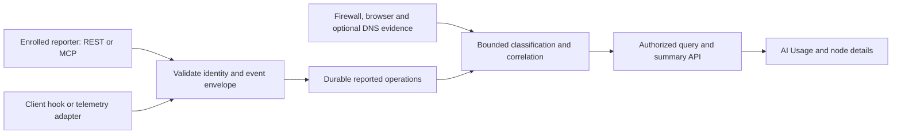

# AI usage reporting and correlation: research decisions

**Completed: 2026-09-24 — PLAN §27.1.** This is the implementation decision record for
the AI usage feature in the workspace's `PLAN.md` §27.
Delivery is now implemented in §27.3; see [setup and validation](AI_USAGE.md). This record
preserves the pre-implementation research snapshot. Findings below come from
official documentation, package metadata and the current repository. Tables labeled
“Decision” or “Required result” describe WinFire requirements, not existing behavior or executed tests.

## 1. Current repository and integration points

| Area inspected | Finding and implementation consequence |
|---|---|
| [Package manifest](../package.json) | Node ≥20, Express 5, Zod 4 and SQLite are already used. MCP and OpenTelemetry packages are not installed. Add adapters to the existing API rather than a second inventory database. |
| [Windows event normalization](../api/src/eventNormalizer.js) | Keeps application, PID, tuple, direction and allowed/blocked outcomes. Use these normalized observations and preserve collector identity. PID alone is not a durable process identity. |
| [WEF receiver](../api/src/wefReceiver.js) | Its explicit event allowlist excludes Sysmon 22. DNS correlation requires a provider/channel-aware ingestion path, schema and subscription changes; adding an event number alone is insufficient. |
| [Internet projection](../api/src/services/internetConnections.js) | Existing bounded queue/backfill, boundary revisions and stable source event IDs can be reused. Forwarded traffic already has separate attribution reasons. |
| [External peer DNS](../api/src/services/internetPeers.js) | PTR cache/history records resolver and lookup time. `observedNames` is currently empty. A reverse lookup is not endpoint DNS-query evidence. |
| [Browser ingestion](../api/src/routes/internet.js), [browser schema](../api/migrations/063_internet_visibility.cjs) | Enrolled devices provide observed hostnames and timestamps, without a destination IP. Current last-two-label domain grouping needs a Public Suffix List replacement before reuse for AI grouping. |
| [Operator authentication](../api/src/security.js), [API mounting](../api/src/app.js) | Operator JWTs have a WinFire issuer and role; they are not MCP resource-scoped OAuth tokens. Reporter authentication needs its own router boundary before the operator authentication gate. |

Source inspection found no AI usage ingestion service, reporter tables, AI view or MCP route.
Section 26 supplies reusable network evidence; it does not supply reported AI operations.

## 2. Architecture decision

Use one versioned ingestion service for REST, MCP and telemetry adapters. Persist accepted
reports before acknowledging them; enqueue correlation separately. Both node details and
the fleet view use the same server-side query, permissions and summary filters.

AI observations include private gateways and local model reports. Do not restrict AI ingestion
to section 26's outside-CIDR projection. An external service address remains a peer; reporting
and correlation never create an inventory asset.

## 3. MCP protocol and dependency decision

The official SDK identifies v2 as stable and implements MCP **2026-07-28**, with separate server,
client and runtime packages. It supports Zod 4, matching this application.
[Official SDK](https://github.com/modelcontextprotocol/typescript-sdk).

Read-only `npm view <package> version engines --json` checks on 2026-09-24 returned:

| Package | Candidate exact version | Purpose |
|---|---|---|
| `@modelcontextprotocol/server` | `2.1.0` | Tool definitions and protocol handling |
| `@modelcontextprotocol/node` | `2.1.0` | Node HTTP adapter |
| `@modelcontextprotocol/express` | `2.0.1` | Express authentication and request guards |
| `@modelcontextprotocol/client` | `2.1.0` | Independent integration client and machine reporting example |

All four declared Node ≥20. These are researched candidates, not installed or compatibility-tested
dependencies. At the MCP delivery step, resolve them together, check peer requirements and security
advisories, pin exact versions in the lockfile, and record the tested matrix. Recheck if delivery
happens after these versions change.

**Decision:** `/mcp/ai-usage` uses Streamable HTTP. The current revision has per-request metadata,
POST requests and JSON or request-scoped SSE responses; it removes protocol sessions and standalone
GET streams. Validate Origin when supplied, reject invalid origins, validate the public Host, and
let the SDK enforce protocol/header consistency. CORS alone does not provide these checks.
[Transport specification](https://modelcontextprotocol.io/specification/2026-07-28/basic/transports/streamable-http).

Target the current revision plus stateless 2025-era clients through the SDK's documented legacy
adapter. Require the same authentication on both paths. Session-dependent legacy clients and the
deprecated HTTP+SSE transport are outside the initial support promise. Local stdio is a separate
adapter with credentials from protected environment/storage. Publish support only for revisions
and real clients exercised during delivery.
[Legacy compatibility](https://ts.sdk.modelcontextprotocol.io/v2/serving/legacy-clients.html).

Expose only `report_ai_usage` and `report_ai_usage_batch`, with bounded input/output schemas and
durable receipts. Describe them as data-writing tools. Stable reporter/event IDs make retries
safe even when a response is lost; MCP transport success alone is not a durable receipt.
The tool interface is explicitly invoked, so this server cannot intercept every other tool or
model call in the client. [MCP tools](https://modelcontextprotocol.io/specification/2026-07-28/server/tools).

## 4. Authentication and attribution decision

Remote MCP is an OAuth **resource server**, using a configured maintained identity provider.
Use the SDK's resource metadata and bearer-verification middleware; avoid its frozen legacy
authorization-server helpers. WinFire remains responsible for mapping a verified identity to
an enrolled reporter. [SDK authorization](https://ts.sdk.modelcontextprotocol.io/v2/serving/authorization.html).

Require HTTPS, protected-resource discovery, `ai:report`, token issuer/audience/expiry validation,
and appropriate OAuth challenges. Interactive clients use authorization code with PKCE; client
registration must match the selected identity provider. Do not accept operator login tokens,
provider API keys or arbitrary tokens intended for another service.
[MCP authorization](https://modelcontextprotocol.io/specification/2026-07-28/basic/authorization).

For unattended reporters, test the SDK's client-credentials flow against the configured provider
and pin its expected issuer. A confidential client must keep its secret outside prompts and
MCP tool arguments. An installation without OAuth may use the separately enrolled REST credential
through the local stdio adapter; this is not a claim of remote OAuth support.
[Machine authentication](https://ts.sdk.modelcontextprotocol.io/v2/clients/machine-auth.html).

**WinFire authorization rules:**

- Resolve `(issuer, subject, client identity)` to an active reporter with explicit allowed nodes.
  Check revocation and node scope on every batch, including requests with otherwise valid tokens.
- Keep workload node, collector node, reporter and claimed actor separate. A remote MCP runner's
  IP or hostname does not authorize it to report for the user's laptop.
- Single-node reporters derive the binding on the server. Multi-node collectors require an
  allowed binding; ambiguous suggestions stay Unmapped. Unauthorized node claims are rejected.
- A claimed username is an attributed assertion, not an authenticated user identity. Reporter
  enrollment controls whether an actor field is allowed and how it is labeled.
- Reporters can write their scoped telemetry and receive receipts; operator RBAC controls fleet
  reads. Credential rotation keeps the reporter ID, so idempotency survives rotation.

## 5. Evidence and counting decision

Windows 5156 records the application/process and network tuple of a permitted connection.
It does not contain prompts, model responses, tokens or a completed application request.
[Microsoft 5156 reference](https://learn.microsoft.com/en-us/previous-versions/windows/it-pro/windows-10/security/threat-protection/auditing/event-5156).

| Input evidence | Decision: presentation and limits |
|---|---|
| Authenticated explicit operation report | **Reported usage**, labeled self-reported or instrumented. Authentication establishes the reporter, not independent proof of execution. |
| Browser hostname matching a reviewed AI service | **Observed AI-service traffic**. Domain-only evidence is useful; leave the connection/IP association empty. |
| Allowed connection plus contemporaneous, compatible process DNS evidence | Observed service contact when the association is unique. A lookup before a connection is supporting evidence, not proof of an inference request. |
| Blocked connection to a matched service | **Blocked attempt**; never a completed AI operation. |
| PTR-only, IP-only or generic application-name match | **Suspected AI traffic**, with the reason and missing evidence visible. |
| Known authentication, update or telemetry endpoint | Supporting service traffic. Exclude from model-operation totals. |
| Shared cloud/CDN IP with no suitable host evidence | Unclassified; do not invent provider attribution. |
| No report, failed collection or no DNS coverage | Unknown coverage; do not present this as zero AI activity. |

**WinFire counting rules:** deduplicate receipts by reporter + event ID and reject conflicting
replays. A start/end lifecycle contributes one operation; unfinished work remains incomplete.
Keep a parent research session distinct from its child model/tool operations. Link observations
many-to-many without adding them to reported-operation counts. Tokens/cost are nullable, never
estimated from connections. Cost needs currency and provenance. Aggregate one authoritative
usage measurement per operation and retain conflicting sources for review.

Correlation uses explicit IDs first, then bounded node/process/time/destination candidates.
IP reuse, NAT, shared gateways, missing process lifetime, DNS ambiguity and clock skew reduce
confidence. Historical classification retains rule version and observation-time evidence;
later PTR lookups do not rewrite an earlier observation as a confirmed site visit.

## 6. Client reporting and OpenTelemetry decision

Choose a deterministic JavaScript/Python reporting wrapper as the first acceptance integration:
it creates stable IDs, emits completion/failure/cancellation metadata, and retries from a bounded
local buffer. A prompt asking an agent to remember to call a reporting tool is only self-reporting
coverage. Reporting failures must not fail the user's underlying task, and reporting calls must
not report themselves recursively.

A first product-specific integration candidate is Claude Code's tool hooks. Its documented
`PostToolUseFailure` misses pre-execution validation rejections and does not cover all cancellation
paths. Pair success/failure hooks with lifecycle handling; a vanished session becomes incomplete,
not successful. Extract an allowlist of metadata and discard `tool_input`, outputs, raw errors
and transcript paths before buffering. [Hooks reference](https://code.claude.com/docs/en/hooks).

Claude Code also documents OpenTelemetry export and content controls. Keep prompt, assistant
response, tool detail/content and raw-body export disabled; use a sanitizing adapter even when
the producer claims metadata-only mode. Exporter configuration alone is not a guarantee that
every operation was captured. [Monitoring](https://code.claude.com/docs/en/monitoring-usage).

OpenTelemetry's GenAI conventions remain in Development. Keep a versioned WinFire envelope
and record the convention/adapter version instead of binding database columns directly to every
upstream attribute. Suggested mapping:

| Source attribute | WinFire meaning |
|---|---|
| Trace/span/parent IDs | Operation relationships; reporter scope still applies |
| `gen_ai.operation.name` | Map to canonical operation; keep a bounded original identifier |
| `gen_ai.provider.name` | Reported provider/platform, which may differ from an upstream model vendor |
| `gen_ai.request.model`, `gen_ai.response.model` | Requested and returned model separately |
| `gen_ai.tool.name`, `gen_ai.tool.call.id` | Tool identity and call correlation |
| `gen_ai.usage.input_tokens`, `gen_ai.usage.output_tokens` | Optional reported totals; cache/reasoning subsets must not be added again |

These mappings follow the [model conventions](https://github.com/open-telemetry/semantic-conventions-genai/blob/main/docs/gen-ai/gen-ai-spans.md)
and [agent/tool conventions](https://github.com/open-telemetry/semantic-conventions-genai/blob/main/docs/gen-ai/gen-ai-agent-spans.md).
Sampled traces and cumulative metrics cannot silently become complete per-operation inventories;
record sample/coverage information and ingest aggregate metrics separately if later supported.

## 7. Domain catalog and DNS decision

Provider allowlists contain both AI service endpoints and unrelated dependencies. Seed reviewed
roles, not an entire allowlist labeled “AI usage.” All entries need source URL, review date,
version, exact/suffix match mode and an administrator override with audit history.

| Official evidence | Decision for the first catalog |
|---|---|
| [OpenAI network recommendations](https://help.openai.com/en/articles/9247338-network-recommendations-for-chatgpt-errors-on-web-and-apps) list ChatGPT, authentication, content and third-party dependencies. | Review `chatgpt.com` and its service-specific subdomains individually; separate auth/content roles. Shared SendGrid, Intercom and CDN dependencies are not AI-positive rules. A broad `openai.com` rule cannot identify a model operation. |
| [Claude network requirements](https://code.claude.com/docs/en/network-config) explicitly put model requests, domain safety checks, feature flags and telemetry on `api.anthropic.com`. | That exact hostname establishes mixed-purpose Claude service contact with suitable evidence. It cannot identify the request type. Keep login, downloads and telemetry roles separate where hostnames permit. |
| [GitHub Copilot allowlist](https://docs.github.com/en/copilot/reference/copilot-allowlist-reference) distinguishes suggestions, user management and telemetry. | Review the `githubcopilot.com` suffix and dedicated suggestion hosts as service candidates. Do not classify generic `github.com`, `api.github.com`, package mirrors or cloud-agent dependencies as AI-positive. |

Normalize valid DNS names to lowercase ASCII/IDNA, remove a terminal dot, and reject malformed
hosts. Exact matches compare the entire hostname. An explicit suffix matches only the root or
`'.' + suffix` boundary. A more-specific role/exclusion wins before any broad service rule;
irreconcilable overlap is rejected or stays ambiguous. Thus `notopenai.com` and
`openai.com.example.org` do not match `openai.com`.

Use a maintained [Public Suffix List](https://publicsuffix.org/learn/) parser for grouping and
rejecting public-suffix rules. Registrable-domain grouping does not itself authorize a provider
match. Additional Gemini, Microsoft/Azure, Bedrock and organization gateway rules remain catalog
delivery work with their own official-source review; the first catalog has no inferred blanket
cloud ranges.

[Sysmon](https://learn.microsoft.com/en-us/windows/security/operating-system-security/sysmon/sysmon-events)
documents process-associated DNS queries (22) and network connections (3). Consume them only
where available. Store provider/channel, node, process GUID or lifetime, query/result and observed
time. Use answer expiry when supplied; otherwise use a bounded configurable association window
and label expiry unknown. Failed queries, stale answers and multiple candidate domains cannot
establish a unique IP/hostname association. Browser hosts remain useful without this join.

Keep endpoint DNS distinct from server PTR. Encrypted DNS, HTTPS/QUIC, VPNs and proxies create
coverage gaps. No TLS interception or deployment of Sysmon is required by this feature.

## 8. Delivery acceptance cases derived from the research

These are explicit gates for §27.3, not claims of completed runtime validation.

| Case | Required result | Delivery owner in PLAN §27.3 |
|---|---|---|
| Retry after persistence but before receipt; restart; credential rotation | One reported operation, same receipt identity; conflicting replay rejected | Durable ingestion / reporter enrollment |
| Current and stateless legacy MCP clients, including auth errors | Recorded client/SDK/protocol matrix; no auth bypass on legacy path | MCP server / release validation |
| Wrong audience, revoked reporter, forged node or actor | Reject unauthorized writes; no fleet data exposed | MCP server / trusted attribution |
| Hook validation rejection, cancellation, missing end, telemetry outage | Correct terminal/incomplete state and coverage; no success invented | Client integrations |
| Local model with no network; private AI gateway | Report accepted under authorized node; not filtered by Internet CIDRs | Ingestion / catalog |
| Allowed, blocked, auth and shared-CDN fixtures | Distinct categories/outcomes, zero inferred model counts | Network observations |
| Stale DNS, shared IP, PID reuse, NAT or collector forwarding | Explain uncertainty and retain candidates; no forced workload attribution | Correlation |
| Parent totals, child spans and cache/reasoning token subsets | No double-counting; unknown stays null | Telemetry adapter / correlation |
| Secret in URL, hook payload, raw error or unexpected field | Removed/rejected before persistence, offline buffering and audit logging | Retention / client integrations |
| Node/fleet views with identical filters | Matching totals, stable 25-row pagination and shared permissions | AI Usage view |

**Research completion:** all six §27.1 conclusions were checked against current primary sources;
package candidates and repository gaps were recorded; transport/auth, attribution, telemetry and
classification decisions have delivery owners and acceptance cases. No external client was
enrolled, no live telemetry was collected, and no MCP interoperability result is claimed here.
