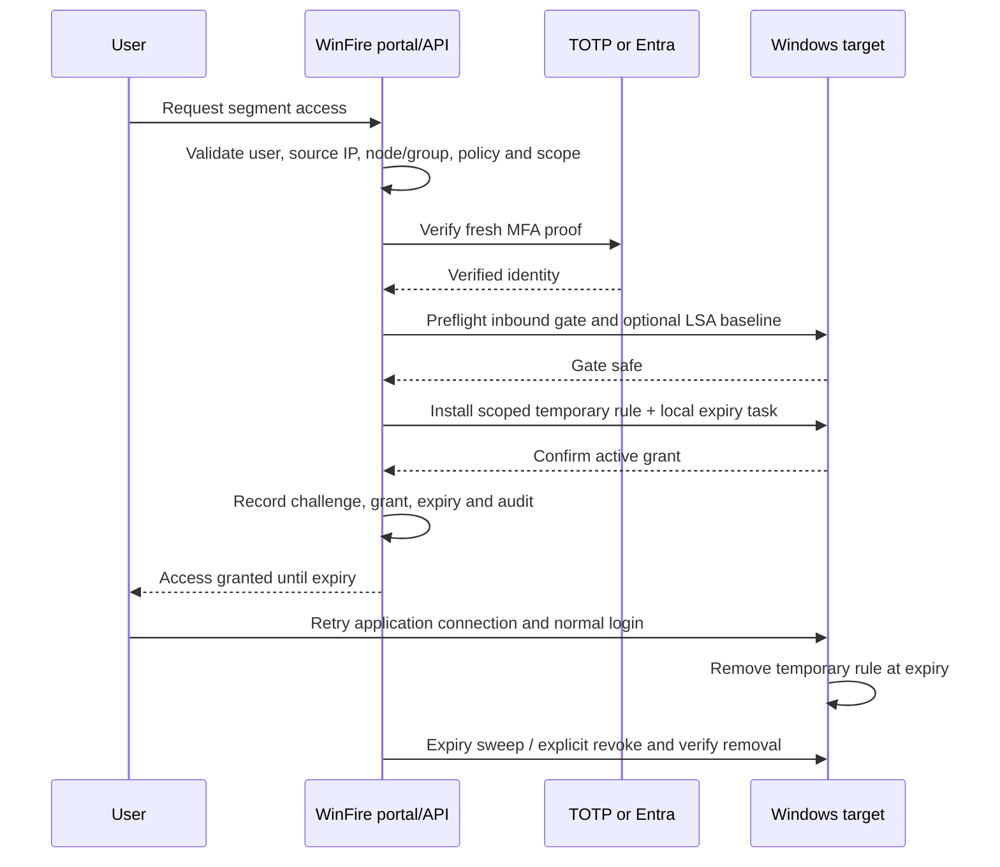

# Just-in-time MFA access

WinFire's agentless JIT portal grants temporary **network access to a protected target** after the user proves identity and completes MFA. The target application still authenticates its own login. Opening a browser is prompt delivery; it does not by itself secure a port or approve a grant.

## Supported paths in this build

| Role | Current implementation |
|---|---|
| Agentless protected target | Windows node with working WinRM/WinRMS, enforced firewall policy, safe inbound firewall gate, and optional enforced LSA account baseline. |
| Windows source workstation | Browser launch through WinRM, with interactive-session/connection evidence. |
| Linux source workstation | SSH-authenticated session discovery and browser launch in an existing X11/Wayland desktop. Requires suitable privileges and an unambiguous usable session. |
| Source with WinFire agent | Prompt job queued to an enrolled, recently connected agent. |
| SNMP or ESXi inventory node | Visibility/inventory collection, not a JIT enforcement target. |
| Linux protected target through this portal | Not currently supported by `portalTarget`: the grant endpoint explicitly requires `winrm` or `winrms`. SSH inventory/firewall management and source-side prompting do not change that restriction. |

The separate universal-agent policy/MFA implementation has platform-specific capabilities. Do not infer support for every OS, process restriction, or identity constraint from the existence of an agent build. Check advertised capabilities and test the actual policy on the intended platform.

## Setup

1. Configure a trusted HTTPS `PUBLIC_BASE_URL` (or Server config URL). Users and source desktops must reach it. When proxied, set trusted proxy CIDRs and verify the server sees the real client IP.
2. Onboard the target using a working Windows credential. Collect facts, finish learning, review the policy and enforce it.
3. In **Identity**, create an agentless segment scoped to exactly one node or node group. Choose the protected TCP port, optional extra ports, allowed user principal names, TOTP or Entra, and a short grant lifetime. The API permits 2–10,080 minutes; choose the shortest practical duration.
4. Keep the segment fail-closed for portal access. A source-process restriction is not enforceable by this agentless portal path and will be rejected.
5. Establish a real firewall gate: all three Windows firewall profiles enabled, inbound default action **Block**, and no conflicting broad allow/block rules for the protected ports. A broad allow bypasses MFA; an overlapping block can override a temporary allow. WinFire performs a remote preflight before creating a grant.
6. If using an account SID gate, enforce the segment's LSA deny baseline first. The baseline preserves the prior rights so they can be restored. This is an additional Windows account-specific control, not implied by a source-IP firewall rule.
7. If linking a policy, assign and sync its current version to the target successfully. The portal checks this before granting access.
8. Enroll users in their selected MFA provider, and test one allowed and one denied request. Enable automatic prompts only after the direct access portal works.

### TOTP

Operators can enroll an authenticator through Administration → Security. AD users can use `/enroll-authenticator` with the configured directory flow. Requests require the current six-digit code; codes are checked against the encrypted enrolled secret and an already-used counter is rejected. A new code is needed if the previous one was consumed.

The signed-in portal request is `POST /segments/{id}/access`. Public prompt flows at `/mfa/{promptId}` have their own credentials/TOTP or Entra endpoints and bind the result to that prompt. Public in this context means no preexisting operator bearer token; it does not mean an unauthenticated user can obtain a grant.

### Entra

Configure tenant, application ID and secret or certificate in Administration/deployment settings. Register the exact redirect URI used by the portal (`/identity` for signed-in portal flows; `/mfa/callback` for public prompt flows when used). Require MFA through Conditional Access and configure the `amr` ID-token claim as described by the application settings. The server validates authorization-code flow state, nonce/PKCE checks, token identity and MFA evidence before granting access. Group synchronization and allowed-user controls determine eligible identities; review the resulting allowed-UPN membership after sync.

## Request and enforcement sequence

The server derives the grant's source address from the HTTP request, rather than trusting an arbitrary `sourceIp` supplied in the access request. It validates that the source lies inside the segment scope and that any prompt refers to the same segment, source and target. NAT can collapse multiple users behind one source IP; plan segment scope and identity controls accordingly.

The rule group is `WinFireSecure:JIT:<grant-id>`, with an exact source IP and the segment's TCP port set. A SYSTEM scheduled task on the target provides local expiry cleanup. WinFire also sweeps expired portal grants every minute and supports explicit revocation. The database is marked revoked only after host removal is confirmed; a failed readback/removal is recorded as unknown/failed and retried by the expiry sweep. If grant creation fails after the rule may have been installed, cleanup is attempted and audited.

A local expiry task reduces dependency on control-plane availability, but delivery/removal errors still require review. Revoking a firewall grant removes access rules; it is not a promise to terminate every already established application session.

## Automatic browser prompting

Automatic prompts start from collected blocked-connection evidence (Windows event 5157) or a matching supported logon-right denial (4625). The server matches the protected segment, identifies the source node, checks for ambiguous/shared addresses, suppresses repeated prompts, and creates a short-lived prompt. The source browser opens the HTTPS portal URL in the relevant interactive session.

Windows prompting uses connection/process/session evidence. Linux source prompting uses SSH and session tools, with a Wayland user-manager launch or an X11 session environment when appropriate. A headless host, missing browser, multiple unresolved desktop sessions, or insufficient privileges can prevent delivery. It does not require weakening X-server access globally. An optional enrolled source agent can receive the prompt as a job instead.

Prompts and challenges typically have a five-minute completion window; this is distinct from the configured **grant lifetime** after approval. A consumed or expired prompt cannot be reused. The user retries the protected connection once access is granted. Automatic prompting also depends on timely event ingestion, enabled audit policy, applicable segment settings and a target that is no longer learning.

## Failure behavior

The default prompt-failure mode is **closed**: failure to identify/control the source does not create an allow rule. Administration can explicitly enable a constrained fail-open fallback (2–15 minutes, default 5) for eligible uncontrolled-source failures. That fallback still requires a safe target gate, is scoped to the observed source and ports, expires, and is audited. It is not successful MFA. Segments using account/process or logged-on-user constraints are excluded from this fallback path.

Segment-level `failOpen` is separate from the prompt-failure setting; the standard portal rejects fail-open segments. Invalid MFA proof, expired/replayed challenges, unassigned users, unsafe firewall gates, missing LSA baseline, learning targets and unsynced linked policies cause a rejected request rather than ordinary access approval.

## Operational verification

- Verify access fails before MFA and opens only after a successful challenge for the intended source/ports.
- Verify another source cannot use the grant.
- Check the host's rule group and scheduled task, not only the UI success message.
- Revoke the grant and verify removal; test expiry with the control plane unavailable in a controlled environment.
- Review **Identity** grants/challenges, **Accounts** events, apply-run results and audit records together.
- Diagnose “gate is not ready” using the reported overlapping rules/profile defaults, not by disabling the firewall.
- Diagnose no prompt using event arrival, source-node mapping, interactive session and management access. Direct portal access is a separate workflow.

See [API examples](API.md#jit-mfa-access) and the source contracts in [API routes](API_ROUTES.md). Implementation references: `api/src/mfaPrompt.js`, `api/src/mfaChallenges.js`, `api/src/mfaPortal.js`, `api/src/app.js` (`portalTarget`/`grantPortalAccess`), and `packages/shared/jitAccess.ps1`.
