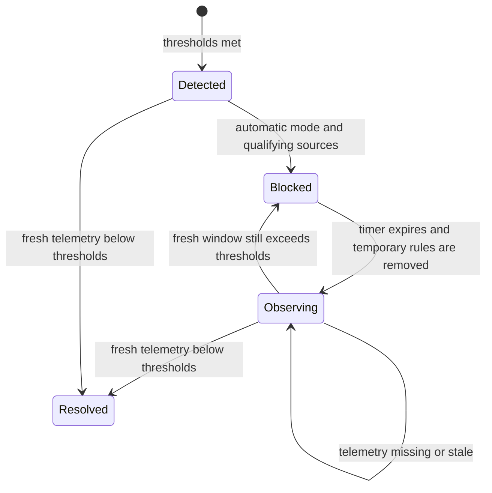

# ServiceNow notifications and DDoS protection

Open **Administration → Notifications**. Tabs separate **Destinations**, **ServiceNow**,
**Security automations**, and **Event exports**. DDoS policies and incidents are under
**Activities → DDoS protection** (`/logs?tab=ddos`). Configuration and
protection administration require an administrator or owner. API keys retain their
owner's permissions and need write scope for mutations.

## ServiceNow incident destination

1. In Administration → Credential vault, add a **ServiceNow** credential with a dedicated
   integration username/password. Passwords use the existing encrypted vault and are never
   returned in settings, delivery records or audit responses. Rotate passwords in the vault.
2. In Notifications → ServiceNow, enter the HTTPS instance origin, such as
   `https://company.service-now.com`, and select the credential. Paths, redirects, embedded
   credentials and non-HTTPS endpoints are rejected; TLS verification stays enabled.
3. Optionally specify an assignment group's 32-character `sys_id`. Set impact and urgency
   (1–3). ServiceNow derives incident priority according to its own rules.
4. Save, then **Test saved connection**. This performs a read-only incident-table query;
   it verifies authentication/read ACLs, not incident creation. The account also needs create
   access to `incident` and write access to the configured incident fields. Basic auth must
   be allowed by the instance's REST authentication policy. OAuth is not implemented here.
5. Enable delivery, then select the **ServiceNow** switch for each desired category under
   Destinations. Preferences belong to the current operator. Other operators can independently
   select categories. DDoS protection is included alongside drift, verification, MFA,
   offline/unreachable nodes and security-policy events.

One correlated incident is shared by recipients of the same event at the same instance.
The worker uses `GET /api/now/v1/table/incident?sysparm_query=correlation_id=…`, then POSTs
only when no record exists. It stores `sys_id` and incident number locally. A lost POST
response is recovered through the correlation lookup on retry. ServiceNow business rules
must preserve the correlation ID and allow the integration account to read its own tickets.
For deployments running multiple independent delivery workers, enforce uniqueness for these
WinFire correlation IDs in ServiceNow as well; external POST and SQLite writes cannot be one
atomic transaction.

The worker runs every 30 seconds, up to 25 deliveries per pass. Failures retry with exponential
backoff for five attempts; failed entries have a **Retry** action. Disabled integration leaves
queued deliveries pending. Suspended recipients' deliveries are cancelled. Ticket deliveries
show status, attempts, sanitized errors and links to created incidents. Updating the instance
or credential affects pending deliveries. Historical tickets remain at their original instance.
Removing a vault credential prevents further delivery and produces a visible failure.

### ServiceNow API

All paths below are relative to `/api/v1`:

| Method | Path | Use |
|---|---|---|
| GET | `/notifications/servicenow` | Read settings and available vault entries |
| PUT | `/notifications/servicenow` | Save enabled state, instance, credential ID and incident defaults |
| POST | `/notifications/servicenow/test` | Test the saved connection without creating a ticket |
| GET | `/notifications/servicenow/deliveries` | Delivery history; page/pageSize, default 25 |
| POST | `/notifications/servicenow/deliveries/:id/retry` | Retry a failed delivery |
| PATCH | `/users/:id/profile` | Save existing `notificationPrefs`, including `ddos_attack.servicenow` |

```bash
curl -sS "$WINFIRE_URL/api/v1/notifications/servicenow" \
  -H "Authorization: Bearer $WINFIRE_ACCESS_TOKEN"
curl -sS -X PUT "$WINFIRE_URL/api/v1/notifications/servicenow" \
  -H "Authorization: Bearer $WINFIRE_ACCESS_TOKEN" -H 'Content-Type: application/json' \
  --data-binary @servicenow-settings.json
curl -sS -X POST "$WINFIRE_URL/api/v1/notifications/servicenow/test" \
  -H "Authorization: Bearer $WINFIRE_ACCESS_TOKEN"
```

`servicenow-settings.json` contains no password:

```json
{"enabled":false,"baseUrl":"https://company.service-now.com","credentialId":"VAULT_ID","assignmentGroup":"","impact":2,"urgency":2}
```

## DDoS detection and temporary host blocks

Open **Activities → DDoS protection** to manage policies and review incidents. Notification
destination switches remain in Administration → Notifications.

This feature detects **suspected traffic surges from collected inbound firewall events**.
It does not measure wire packets/second or bytes/second, inspect HTTP requests, or distinguish
all legitimate traffic bursts from attacks. Event collection latency limits reaction time.
SNMP state/ARP snapshots are not packet-rate evidence. Hosts need a fresh firewall-event feed;
Linux SSH facts alone do not provide that feed. Use upstream DDoS protection for traffic that
could saturate the link before it reaches the host.

### Policy configuration

New policies are **disabled**, with **detection-only** selected. Select one or more nodes,
TCP or UDP, and explicit destination service ports. One enabled policy can own each node.
Each node is evaluated independently; one policy can protect several nodes.

Defaults: 60-second window; 1,000 events and 20 distinct sources; at least 10 events per
source for automatic blocking; 300-second blocks; 60-second observation after release.
Choose thresholds using **Preview** and your normal traffic. Preview never applies rules.
Changing a policy starts its detection window from the update time; historical events are
not used to trigger new protection.

Local-source CIDRs are excluded by default. Add trusted clients, proxies, load balancers,
health monitors, NAT gateways and other exceptions as source CIDRs. Sources matching the
node's primary IP or the control plane's interface IPs are excluded. When NAT is involved,
configure `WINFIRE_CONTROL_PLANE_IPS` as comma-separated management source IPs. Source
exceptions apply both to threshold counts and automatic blocks.

Automatic blocking requires agentless WinRM/WinRMS or SSH. SNMP, ESXi API, WMI/netsh and
agent-only nodes cannot use this new enforcement path. Windows needs NetSecurity and
ScheduledTasks cmdlets with administrative privileges. Linux needs nftables and passwordless
`sudo`; support is confirmed when applying the operation and failures remain visible. Other
inventory types can use detection when firewall events are available.

Management ports 22, 135, 139, 445, 3389, 5985 and 5986 cannot be automatically blocked.
Existing control-plane firewall guards also apply. A block uses at most 100 qualifying source
IP addresses and the selected protocol/service ports. IPv4 and IPv6 are supported. Windows
rules live in a separate `WinFireDDoS:` group; Linux rules live in separate `wfddos_` tables.
No baseline policy rules are removed and no blanket allow rule is installed.

### Block cycle and recovery



The evaluator runs every 10 seconds. Intent is persisted before contacting a host. A confirmed
block requires native expiry: Windows installs SYSTEM scheduled cleanup **before** adding
rules; Linux uses kernel nftables element timeouts. If the API goes offline, those host-side
mechanisms still release traffic. Windows cleanup runs when the host becomes available after
missing a scheduled time and is permitted on battery power. Host firewall services, task
scheduler and privileges must remain operational for cleanup to succeed.

After release, the evaluator waits a complete observation period (at least the detection
window). Continued attacks produce another timed block. A telemetry gap never means the
attack ended: the incident stays open with an explicit unconfirmed message. Partial/failed
commands retain block intent and are removed before retrying a new block. Windows readback
checks the effective rule. Failed removals are retained and retried, not silently declared
successful. State survives an API restart. Native Linux timeout removes elements; WinFire
subsequently removes its empty table.

**Stop / release** disables the policy for all its nodes and removes the selected incident's
rules immediately. Other active incidents are cleaned on the next cycle. The API returns 409
if evaluation is currently using a host; retry shortly. Deleting a policy with an active
incident is refused. Deleted policies are archived with their incident history. Incidents
include source counts, block cycles, expiry, errors and transition history. Transitions emit
notifications, including ServiceNow tickets when selected.

A scan reads at most 100,001 recent matching events per node. Above that bound, automatic
blocking is withheld and the incident reports the limit. This is a bounded event-based
mitigation feature, not a full volumetric scrubbing service.

### DDoS API

| Method | Path | Use |
|---|---|---|
| GET/POST | `/protection/ddos/policies` | List/create policies |
| PUT/DELETE | `/protection/ddos/policies/:id` | Replace configuration/archive policy |
| GET | `/protection/ddos/policies/:id/preview` | Current per-node evidence without enforcement |
| GET | `/protection/ddos/incidents` | q, status=all/active/closed, page, pageSize (25 default) |
| GET | `/protection/ddos/incidents/:id` | Evidence and transition history |
| POST | `/protection/ddos/incidents/:id/release` | Disable policy and release temporary rules |

```bash
curl -sS "$WINFIRE_URL/api/v1/protection/ddos/policies" \
  -H "Authorization: Bearer $WINFIRE_ACCESS_TOKEN" -H 'Content-Type: application/json' \
  --data-binary @ddos-policy.json
curl -sS "$WINFIRE_URL/api/v1/protection/ddos/policies/$POLICY_ID/preview" \
  -H "Authorization: Bearer $WINFIRE_ACCESS_TOKEN"
curl -sS "$WINFIRE_URL/api/v1/protection/ddos/incidents?status=active&page=1&pageSize=25" \
  -H "Authorization: Bearer $WINFIRE_ACCESS_TOKEN"
```

`ddos-policy.json`, with detection-only enabled intentionally:

```json
{"name":"Public web service","enabled":true,"mode":"detect","nodeIds":["NODE_ID"],"protocol":"TCP","ports":[443],"windowSeconds":60,"eventThreshold":1000,"sourceThreshold":20,"perSourceThreshold":10,"blockSeconds":300,"observeSeconds":60,"excludeLocal":true,"excludedCidrs":[]}
```

### Deployment and verification

Back up SQLite and the existing vault/PKI material. Deploy frontend, API and shared scripts
together and restart the API so migration **110** and the routes load. No new npm packages,
external account or automatic policy is provisioned. No production blocking is enabled by
installation. Public API schemas include the full request contracts.

Run `node --test api/tests/protection.test.js` for isolated ServiceNow response-loss/dedup,
role checks, vault secrecy, detection exclusions, block-cycle, telemetry-gap and recovery
tests. Native rule execution must also be piloted on disposable Windows/Linux hosts and a
ServiceNow test instance before enabling automatic production policies.

### Research references

- [ServiceNow Table API](https://www.servicenow.com/docs/r/xanadu/api-reference/rest-apis/c_TableAPI.html)
- [ServiceNow REST authentication and table ACLs](https://www.servicenow.com/docs/r/api-reference/rest-api-explorer/c_RESTAPI.html)
- [Microsoft Register-ScheduledTask](https://learn.microsoft.com/en-us/powershell/module/scheduledtasks/register-scheduledtask?view=windowsserver2025-ps)
- [nftables element timeouts](https://wiki.nftables.org/wiki-nftables/index.php/Element_timeouts)
- [Cloudflare DDoS architecture and network protection](https://developers.cloudflare.com/ddos-protection/about/components/)
